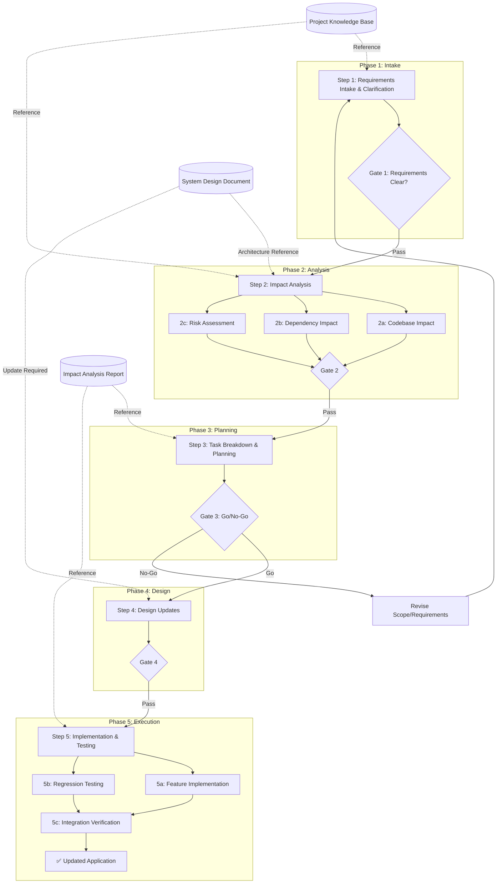

# Additional Requirements Flow

## 🔄 AI-Assisted Change Management for Existing Applications

### Core Principle

**"Analyze Before You Act"** - Comprehensive impact analysis ensures safe integration of new requirements into existing systems.

This approach enables controlled evolution of existing AI-assisted applications while preserving stability and maintaining architectural integrity.

---

## Executive Summary

| Attribute | Description |
|-----------|-------------|
| **Document Version** | 1.1A |
| **Last Updated** | February 19, 2026 |
| **Process Owner** | Product Development Team |
| **Target Audience** | Development Teams, Project Managers, Business Stakeholders |
| **Process Scope** | Adding new requirements to existing AI-assisted applications |
| **Review Frequency** | Quarterly or after major process changes |

---

## Process Flow Diagram



---

## Success Metrics & KPIs

| Metric | Target | Measurement Method | Owner |
|--------|--------|-------------------|-------|
| Impact Analysis Accuracy | ≥95% | Unidentified impacts found post-implementation | Tech Lead |
| Regression Test Pass Rate | 100% | Existing functionality preserved | QA |
| Breaking Change Detection | 100% | All breaking changes identified upfront | Tech Lead |
| Task Estimation Accuracy | ≥85% | Actual vs estimated effort | Scrum Master |
| Requirements Traceability | 100% | All new requirements linked to implementation | BA |
| On-Time Delivery | ≥90% | Sprint completion rate | Scrum Master |
| Architecture Compliance | 100% | Changes align with existing SDD | Tech Lead |

---

## Stakeholder RACI Matrix

| Activity | PO | Tech Lead | Dev Team | QA | BA | Scrum Master |
|----------|-------|-----------|----------|----|----|--------------|
| Requirements Intake | A | C | I | I | R | I |
| Impact Analysis | C | A | R | C | C | I |
| Task Breakdown | A | R | C | C | C | R |
| Design Updates | C | A | R | I | C | I |
| Implementation | I | A | R | C | I | C |
| Regression Testing | A | C | I | R | C | C |

**Legend:** R=Responsible, A=Accountable, C=Consulted, I=Informed

---

## Assumptions & Constraints

### Assumptions

| ID | Assumption | Impact if False | Mitigation |
|----|------------|-----------------|------------|
| A1 | Existing documentation (PKB, SDD, PRD) is current | Incorrect impact analysis | Document audit before analysis |
| A2 | Codebase is under version control | Cannot track changes | Establish VCS before proceeding |
| A3 | Existing test suite available | Cannot verify regression | Build characterization tests first |
| A4 | Original architecture decisions documented | Design conflicts | ADR reconstruction exercise |
| A5 | Team familiar with existing codebase | Analysis delays | Knowledge transfer sessions |

### Constraints

| ID | Constraint | Type | Impact |
|----|------------|------|--------|
| C1 | Must maintain backward compatibility | Technical | Limits implementation options |
| C2 | Existing SLAs must not be degraded | Operational | Performance testing required |
| C3 | Regulatory compliance maintained | Regulatory | Additional validation steps |
| C4 | Budget ceiling for changes | Financial | Scope prioritization |
| C5 | Integration with existing systems | Technical | API versioning required |

---

## Escalation Matrix

| Issue Type | First Level | Second Level | Timeline |
|------------|-------------|--------------|----------|
| Scope conflicts | Product Owner | Steering Committee | 48 hours |
| Technical blockers | Tech Lead | CTO/Architect | 24 hours |
| Breaking change disputes | BA + Tech Lead | PO + Sponsor | 48 hours |
| Resource conflicts | Scrum Master | PMO | 24 hours |
| Quality concerns | QA Lead | Tech Lead + PO | 24 hours |
| Architecture drift | Tech Lead | Architecture Board | 48 hours |

---

## Communication Plan

| Event | Audience | Frequency | Channel | Owner |
|-------|----------|-----------|---------|-------|
| Impact Analysis Review | All Stakeholders | Per Request | Meeting | Tech Lead |
| Task Planning Session | Dev Team, PO | Per Sprint | Meeting | Scrum Master |
| Progress Update | Leadership | Weekly | Email/Dashboard | PM |
| Technical Deep Dive | Tech Team | As Needed | Meeting | Tech Lead |
| Regression Test Results | All Stakeholders | Per Release | Report | QA |
| Change Deployment | Organization | At Release | Email/Announcement | PM |

---

## Additional Requirements Steps

### Step 1: Requirements Intake & Clarification

**Purpose:** Capture, validate, and clarify new requirements before analysis.

**Entry Criteria:**
- [ ] Change request or feature request submitted
- [ ] Business sponsor identified
- [ ] Initial scope understood

**Phase Gate Criteria:**
- [ ] Requirements documented in clear, unambiguous language
- [ ] Business objectives defined with measurable outcomes
- [ ] Requirements validated with stakeholders
- [ ] No conflicting requirements remain unresolved
- [ ] Priority assigned (MoSCoW or WSJF)

**Input Requirements:**
| Input | Source | Quality Criteria |
|-------|--------|------------------|
| Change request | Stakeholders | Complete description |
| Business justification | Sponsor | ROI documented |
| Project Knowledge Base | Existing docs | Current and accessible |
| Existing PRD | Project docs | For context and conflict check |

**Key Activities:**
- Capture detailed requirements with acceptance criteria
- Validate requirements against existing PKB and PRD
- Identify potential conflicts with existing functionality
- Clarify ambiguous requirements through stakeholder dialogue
- Document business objectives and success metrics
- Assign priority using established prioritization framework

**Recommended Agents & Skills:**
- **Agent:** `business-analyst` - Requirements elicitation, stakeholder interviews, conflict identification, and requirements documentation
- **Agent:** `product-manager` - Feature prioritization, RICE scoring, and roadmap alignment
- **Skill:** `requirements-clarity` - Transform vague requirements into actionable specifications with 100-point scoring system

**Output Artifacts:**
| Artifact | Format | Owner | Retention |
|----------|--------|-------|-----------|
| Additional Requirements Document | Markdown | BA | Project lifetime |
| Requirements Validation Checklist | Checklist | BA | Project lifetime |
| Stakeholder Sign-off | Document | PO | Project lifetime |
| Priority Assessment | Matrix | PO | Project lifetime |

**Risks & Mitigations:**
| Risk | Probability | Impact | Mitigation | Owner |
|------|-------------|--------|------------|-------|
| Ambiguous requirements | High | High | Structured clarification sessions | BA |
| Conflicting with existing features | Medium | High | PRD cross-reference analysis | BA |
| Scope creep | High | Medium | Clear scope boundaries | PO |
| Missing stakeholders | Medium | Medium | Stakeholder mapping | PM |

**Exit Criteria:**
- [ ] Requirements document completed and signed off
- [ ] All clarification questions resolved
- [ ] Priority assigned and approved
- [ ] Gate 1 sign-off obtained

---

### Step 2: Impact Analysis

**Purpose:** Comprehensively analyze how new requirements affect the existing application.

**Entry Criteria:**
- [ ] Gate 1 passed
- [ ] Requirements document available
- [ ] Access to existing codebase, SDD, and PRD
- [ ] Development team available for analysis

**Phase Gate Criteria:**
- [ ] All affected components identified and documented
- [ ] All dependencies mapped with update requirements
- [ ] Breaking changes identified and documented
- [ ] Integration points with existing functionality documented
- [ ] Risk assessment completed with severity ratings
- [ ] Impact Analysis Report approved by Tech Lead

**Input Requirements:**
| Input | Source | Quality Criteria |
|-------|--------|------------------|
| Additional Requirements Document | Step 1 | Signed off |
| System Design Document (SDD) | Project docs | Current version |
| Architecture Diagrams (C4) | Project docs | Up-to-date |
| Existing codebase | Repository | Access confirmed |
| API Specifications | Project docs | Current version |
| Database Schema (ERD) | Project docs | Current version |
| Test suites | Repository | Comprehensive coverage |

**Key Activities:**

*Codebase Impact Analysis:*
- **Identify affected files and modules** - Map each requirement to specific files, classes, and functions
- **Analyze code dependencies** - Trace import chains and function calls that may be affected
- **Assess modification complexity** - Rate each change as Low/Medium/High complexity
- **Identify shared components** - Flag reusable components that multiple features depend on
- **Review code coupling** - Assess tight coupling that may cause cascading changes

*Dependency Impact Analysis:*
- **External dependency review** - Check if package updates are required
- **API contract analysis** - Identify API changes and versioning needs
- **Database schema impact** - Assess schema modifications and migration requirements
- **Integration point mapping** - Document upstream/downstream system effects
- **Configuration changes** - Identify environment and configuration updates needed

*Risk Assessment:*
- **Breaking change identification** - Document backward-incompatible changes
- **Data migration risks** - Assess data transformation requirements
- **Performance impact** - Predict load and response time effects
- **Security implications** - Review security posture changes
- **Rollback complexity** - Assess difficulty of reverting changes

**Impact Analysis Checklist:**
- [ ] All affected files listed with modification type (create/modify/delete)
- [ ] All affected modules mapped with change descriptions
- [ ] Direct dependencies identified (imports, calls)
- [ ] Indirect dependencies traced (2+ levels)
- [ ] External package updates required (if any)
- [ ] API changes documented with versioning strategy
- [ ] Database schema changes documented with migration plan
- [ ] Integration points verified with change requirements
- [ ] Breaking changes flagged with mitigation strategies
- [ ] Performance impact estimated
- [ ] Security review completed
- [ ] Rollback procedure outlined

**Recommended Agents & Skills:**
- **Agent:** `code-explorer` - Deep feature tracing, execution path mapping, architecture layer analysis, and dependency documentation
- **Agent:** `architecture-reviewer` - Well-Architected framework validation, design review, and scalability analysis
- **Agent:** `legacy-modernizer` - Technical debt assessment and impact measurement
- **Agent:** `diagram-architect` - Visualize impact through updated diagrams

**Output Artifacts:**
| Artifact | Format | Owner | Retention |
|----------|--------|-------|-----------|
| Impact Analysis Report | Markdown | Tech Lead | Project lifetime |
| Affected Components Matrix | Spreadsheet | Tech Lead | Project lifetime |
| Dependency Map | Diagram | Tech Lead | Project lifetime |
| Breaking Changes Register | Spreadsheet | Tech Lead | Project lifetime |
| Risk Assessment Matrix | Spreadsheet | Tech Lead | Project lifetime |
| Integration Points Document | Markdown | Tech Lead | Project lifetime |

**Risks & Mitigations:**
| Risk | Probability | Impact | Mitigation | Owner |
|------|-------------|--------|------------|-------|
| Hidden dependencies | High | High | Comprehensive code tracing, test coverage analysis | Tech Lead |
| Underestimated scope | High | High | Include buffer, peer review of analysis | Tech Lead |
| Outdated documentation | Medium | High | Document audit before analysis | BA |
| Missing integration points | Medium | High | Integration inventory with SMEs | Tech Lead |
| Undocumented tribal knowledge | Medium | Medium | Team interviews, code archaeology | Tech Lead |

**Exit Criteria:**
- [ ] Impact Analysis Report completed
- [ ] All affected components documented with change types
- [ ] All dependencies mapped with update requirements
- [ ] Breaking changes register finalized
- [ ] Risk assessment completed and prioritized
- [ ] Gate 2 sign-off obtained


---

### Step 3: Task Breakdown & Planning

**Purpose:** Generate a detailed, actionable task breakdown with dependencies, sequencing, and complexity estimates.

**Entry Criteria:**
- [ ] Gate 2 passed
- [ ] Impact Analysis Report available
- [ ] Team capacity known
- [ ] Breaking changes accepted by stakeholders

**Phase Gate Criteria (Go/No-Go Decision):**
- [ ] All tasks defined with clear acceptance criteria
- [ ] Task dependencies mapped and sequenced
- [ ] Complexity/effort estimated for each task
- [ ] Sprint capacity aligned with task estimates
- [ ] Go/No-Go decision documented with rationale
- [ ] Stakeholder approval on scope and timeline

**Input Requirements:**
| Input | Source | Quality Criteria |
|-------|--------|------------------|
| Impact Analysis Report | Step 2 | Signed off |
| Additional Requirements Document | Step 1 | Current |
| Team velocity | Historical data | Reliable baseline |
| Existing backlog | Project management tool | Current and prioritized |
| SDD | Project docs | For architecture context |

**Key Activities:**

*Task Generation:*
- **Decompose requirements into discrete tasks** - Each task should be independently completable
- **Apply INVEST criteria** - Independent, Negotiable, Valuable, Estimable, Small, Testable
- **Create task hierarchy** - Epic → Story → Task → Subtask
- **Define acceptance criteria** - Given/When/Then format for each task
- **Identify technical tasks** - Database migrations, API updates, configuration changes

*Dependency Mapping:*
- **Map task dependencies** - Identify which tasks must complete before others
- **Identify parallel paths** - Group independent tasks for parallel execution
- **Sequence critical path** - Determine minimum timeline based on dependencies
- **Flag blocking tasks** - Highlight tasks that block multiple downstream tasks
- **Document external dependencies** - Third-party APIs, team availability, etc.

*Estimation & Complexity:*
- **Estimate story points** - Using team's established scale (Fibonacci)
- **Assess complexity indicators** - Low/Medium/High with justification
- **Identify risk factors** - Uncertainty, novelty, dependencies
- **Include buffer** - 20-30% for unknown unknowns
- **Compare with similar past work** - Reference historical data

**Task Breakdown Template:**
| Task ID | Task Name | Type | Complexity | Story Points | Dependencies | Priority | Sprint |
|---------|-----------|------|------------|--------------|--------------|----------|--------|
| T001 | Example task | Feature | Medium | 5 | None | Must | 1 |
| T002 | Another task | Technical | High | 8 | T001 | Must | 1 |

**Complexity Assessment Criteria:**
| Complexity | Criteria | Story Points Range |
|------------|----------|-------------------|
| Low | Single file change, well-understood pattern | 1-3 |
| Medium | Multiple files, some new patterns, moderate testing | 5-8 |
| High | Architectural changes, complex integrations, extensive testing | 13-21 |
| Very High | System-wide impact, significant unknowns | 21+ (consider splitting) |

**Recommended Agents & Skills:**
- **Agent:** `atlassian-requirements-to-jira` - Transform requirements into Jira epics/stories with INVEST criteria, story points, and dependencies
- **Skill:** `agile-product-owner` - INVEST-compliant user story generation, sprint capacity planning, backlog prioritization
- **Skill:** `writing-plans` - Comprehensive implementation plans with task breakdown, verification criteria, DRY/YAGNI/TDD principles

**Output Artifacts:**
| Artifact | Format | Owner | Retention |
|----------|--------|-------|-----------|
| Task Breakdown Document | Markdown/Spreadsheet | Tech Lead | Project lifetime |
| Dependency Map | Diagram (DAG) | Tech Lead | Per release |
| Sprint Plan | Jira/Markdown | Scrum Master | Per sprint |
| Critical Path Analysis | Diagram | Tech Lead | Per release |
| Go/No-Go Decision | Sign-off Document | PO | Project lifetime |
| Effort Estimate Summary | Spreadsheet | Scrum Master | Per release |

**Risks & Mitigations:**
| Risk | Probability | Impact | Mitigation | Owner |
|------|-------------|--------|------------|-------|
| Underestimation | High | High | Include buffer, compare with historical data | Scrum Master |
| Missing dependencies | Medium | High | Cross-team dependency review, peer analysis | Tech Lead |
| Scope overload | Medium | Medium | Strict prioritization, MVP definition | PO |
| Task too large | Medium | Medium | Apply INVEST criteria, enforce story point limits | Scrum Master |
| Hidden complexity | High | Medium | Technical spike for uncertain areas | Tech Lead |

**Exit Criteria:**
- [ ] Task Breakdown Document completed
- [ ] All tasks have acceptance criteria
- [ ] Dependencies mapped and sequenced
- [ ] Story points estimated for all tasks
- [ ] Sprint plan created for initial sprints
- [ ] Go/No-Go decision made and documented
- [ ] Gate 3 sign-off obtained (if Go)


---

### Step 4: Design Updates

**Purpose:** Update system design artifacts to incorporate new requirements while maintaining architectural integrity.

**Entry Criteria:**
- [ ] Gate 3 passed (Go decision)
- [ ] Impact Analysis Report available
- [ ] Task Breakdown completed
- [ ] Original SDD and architecture diagrams accessible

**Phase Gate Criteria:**
- [ ] SDD updated with new components/changes
- [ ] Architecture diagrams updated (C4, sequence, ERD)
- [ ] API contracts updated or versioned
- [ ] Database migration scripts designed
- [ ] ADRs created for significant decisions
- [ ] Design review completed

**Input Requirements:**
| Input | Source | Quality Criteria |
|-------|--------|------------------|
| Impact Analysis Report | Step 2 | Signed off |
| Task Breakdown Document | Step 3 | Approved |
| Existing SDD | Project docs | Current version |
| Existing Architecture Diagrams | Project docs | Current version |
| API Specifications | Project docs | Current version |
| Database Schema | Project docs | Current version |

**Key Activities:**

*Architecture Updates:*
- **Update C4 diagrams** - Add/modify context, container, component views as needed
- **Update sequence diagrams** - Document new interaction patterns
- **Update ERD** - Add new entities, relationships, modify existing schema
- **Design database migrations** - Plan zero-downtime migration approach
- **Update deployment diagrams** - If infrastructure changes required

*API Design:*
- **Update API specifications** - Add new endpoints, modify existing
- **Design versioning strategy** - If breaking changes unavoidable
- **Document backward compatibility** - Deprecation timelines, migration paths
- **Update integration contracts** - For upstream/downstream systems

*Decision Documentation:*
- **Create ADRs** - For significant architectural decisions
- **Document trade-offs** - Alternatives considered and rationale
- **Update technical documentation** - Inline docs, README updates

**Recommended Agents & Skills:**
- **Agent:** `arch` - Senior Cloud Architect for architecture diagram updates, NFR analysis, and phased approach planning
- **Agent:** `adr-generator` - Creates Architecture Decision Records for significant changes
- **Agent:** `api-designer` - API versioning strategies, OpenAPI 3.1 specs, backward compatibility planning
- **Skill:** `c4-architecture` - C4 model diagrams in Mermaid syntax
- **Skill:** `database-schema-designer` - Schema updates with migration strategies
- **Skill:** `migration-guide` - Zero-downtime migration planning

**Output Artifacts:**
| Artifact | Format | Owner | Retention |
|----------|--------|-------|-----------|
| Updated SDD | Markdown | Tech Lead | Project lifetime |
| Updated Architecture Diagrams | Mermaid/Draw.io | Tech Lead | Project lifetime |
| Updated API Specifications | OpenAPI/Swagger | Tech Lead | Project lifetime |
| Updated Database Schema | ERD | DBA | Project lifetime |
| Database Migration Scripts | SQL/Code | DBA | Project lifetime |
| ADRs for New Decisions | Markdown | Tech Lead | Project lifetime |
| Design Review Notes | Markdown | Tech Lead | Project lifetime |

**Risks & Mitigations:**
| Risk | Probability | Impact | Mitigation | Owner |
|------|-------------|--------|------------|-------|
| Design conflicts | Medium | High | Design review with full team | Tech Lead |
| Over-engineering | Medium | Medium | Focus on minimal changes | Tech Lead |
| Migration complexity | Medium | High | Incremental migration approach | DBA |
| API versioning issues | Medium | High | Clear deprecation policy | Tech Lead |
| Missing diagram updates | Medium | Medium | Checklist-driven update process | Tech Lead |

**Exit Criteria:**
- [ ] SDD updated and reviewed
- [ ] All architecture diagrams current
- [ ] API specifications updated with versioning (if applicable)
- [ ] Database migration scripts designed and reviewed
- [ ] ADRs created for significant decisions
- [ ] Gate 4 sign-off obtained

---

### Step 5: Implementation & Testing

**Purpose:** Implement changes with comprehensive testing ensuring existing functionality is preserved.

**Entry Criteria:**
- [ ] Gate 4 passed
- [ ] Development environment ready
- [ ] Updated SDD and design artifacts available
- [ ] Sprint backlog defined with tasks from Step 3

**Phase Gate Criteria:**
- [ ] All features implemented per acceptance criteria
- [ ] Unit test coverage maintained (≥80%)
- [ ] Regression tests passing (100%)
- [ ] Integration tests passing
- [ ] Architecture verification completed
- [ ] Code review completed and approved
- [ ] UAT sign-off obtained

**Input Requirements:**
| Input | Source | Quality Criteria |
|-------|--------|------------------|
| Task Breakdown Document | Step 3 | Approved |
| Updated SDD | Step 4 | Current |
| Updated Architecture Diagrams | Step 4 | Current |
| Updated API Specifications | Step 4 | Current |
| Database Migration Scripts | Step 4 | Tested |
| Impact Analysis Report | Step 2 | For verification |
| Existing test suites | Repository | Comprehensive |

**Key Activities:**

*Feature Implementation:*
- **Implement features following TDD** - Red-Green-Refactor cycle
- **Follow existing code patterns** - Maintain consistency with codebase
- **Apply SOLID principles** - Single responsibility, open-closed, etc.
- **Update inline documentation** - Comments, JSDoc, docstrings
- **Conduct code reviews** - Minimum 2 reviewers
- **Maintain conventional commits** - Clear change history

*Regression Testing:*
- **Run existing test suite** - Ensure no regressions
- **Add characterization tests** - For modified components without tests
- **Integration testing** - Verify component interactions
- **E2E testing** - Validate user flows
- **Performance testing** - Ensure SLAs maintained
- **Security scanning** - OWASP Top 10, dependency audit

*Integration Verification:*
- **Verify against Impact Analysis** - Cross-reference all identified components
- **API contract testing** - Validate against OpenAPI specs
- **Database migration testing** - Dry run, rollback testing
- **Architecture compliance check** - Compare implementation to SDD
- **Upstream/downstream verification** - Test integration points

**Regression Testing Checklist:**
- [ ] All existing unit tests passing
- [ ] All existing integration tests passing
- [ ] All existing E2E tests passing
- [ ] Performance benchmarks maintained
- [ ] New tests added for new functionality
- [ ] Characterization tests added for modified components
- [ ] Security scan completed with no new vulnerabilities
- [ ] Database migration tested with rollback verified


**Recommended Agents & Skills:**
- **Skill:** `test-driven-development` - Comprehensive TDD guidance with Red-Green-Refactor cycle
- **Agent:** `wg-code-alchemist` - Clean Code practices, SOLID principles, code transformation
- **Skill:** `executing-plans` - Structured implementation with batch execution and review checkpoints
- **Agent:** `qa-expert` - QA strategy, test planning, regression testing, UAT coordination
- **Agent:** `test-engineer` - Test automation for unit, integration, E2E, and performance testing
- **Skill:** `playwright-e2e-builder` - E2E testing automation
- **Agent:** `refactoring-specialist` - Safe code transformation, behavior preservation

**Output Artifacts:**
| Artifact | Format | Owner | Retention |
|----------|--------|-------|-----------|
| Updated Application Code | Repository | Dev Team | Project lifetime |
| New/Updated Unit Tests | Test Suite | Dev Team | Project lifetime |
| Regression Test Results | Report | QA | Per release |
| Integration Test Results | Report | QA | Per release |
| E2E Test Results | Report | QA | Per release |
| Performance Test Results | Report | QA | Per release |
| Security Scan Report | Report | Security | Per release |
| Code Review Records | PR Comments | Tech Lead | Project lifetime |
| UAT Sign-off | Document | PO | Project lifetime |
| Release Notes | Markdown | PM | Per release |

**Risks & Mitigations:**
| Risk | Probability | Impact | Mitigation | Owner |
|------|-------------|--------|------------|-------|
| Regression bugs | Medium | High | Comprehensive regression testing | QA |
| Integration failures | Medium | High | Staged integration, feature flags | Tech Lead |
| Performance degradation | Medium | High | Load testing before release | QA |
| Data migration errors | Low | Critical | Multiple dry runs, validation scripts | DBA |
| Architecture drift | Medium | High | Sprint-level architecture verification | Tech Lead |
| Missing test coverage | Medium | Medium | Coverage enforcement in CI/CD | Dev Team |

**Exit Criteria:**
- [ ] All features implemented and code reviewed
- [ ] Unit test coverage ≥80%
- [ ] All regression tests passing (100%)
- [ ] Integration tests passing
- [ ] E2E tests passing
- [ ] Performance benchmarks met
- [ ] Security scan completed with no critical issues
- [ ] UAT sign-off obtained
- [ ] Release candidate tagged
- [ ] Deployment runbook prepared

---

## Data Flow Summary

| Step | Primary Output | Used By | Dependencies | Owner |
|------|----------------|---------|--------------|-------|
| **1. Requirements Intake** | Additional Requirements Document | Steps 2, 3, 5 | Existing PKB, PRD | BA |
| **2. Impact Analysis** | Impact Analysis Report | Steps 3, 4, 5 | Step 1, SDD, Codebase | Tech Lead |
| **3. Task Breakdown** | Task Breakdown Document | Steps 4, 5 | Steps 1, 2 | Tech Lead |
| **4. Design Updates** | Updated SDD, Diagrams, ADRs | Step 5 | Steps 2, 3, Existing SDD | Tech Lead |
| **5. Implementation** | Updated Application, Tests | Deployment | Steps 2, 3, 4 | Dev Team |

### Impact Analysis Flow

```
┌─────────────────────────────────────────────────────────────────────────────┐
│  Impact Analysis (Step 2) - Comprehensive Change Assessment                │
├─────────────────────────────────────────────────────────────────────────────┤
│                                                                             │
│  Requirements ─────────────────────────────────────────┐                    │
│       │                                                │                    │
│       └── Codebase Analysis ───────► Affected Components                   │
│       │                                                                     │
│       └── Dependency Analysis ─────► Required Updates                      │
│       │                                                                     │
│       └── Risk Assessment ─────────► Breaking Changes                      │
│                                                        │                    │
│                                                        ▼                    │
│  Impact Analysis Report ◄──────────────────── Consolidated Analysis        │
│       │                                                                     │
│       └── Used By: Task Breakdown, Design Updates, Implementation          │
│                                                                             │
└─────────────────────────────────────────────────────────────────────────────┘
```

### Context Preservation Pattern (Additional Requirements)

```
┌─────────────────────────────────────────────────────────────────┐
│  Existing Artifacts as Foundation                               │
├─────────────────────────────────────────────────────────────────┤
│                                                                 │
│  PKB + PRD + SDD ──────────────────────────────────┐            │
│       │                                            │            │
│       └── Referenced Throughout All Steps          │            │
│                                                    │            │
│  Step 1 ──► Step 2 ──► Step 3 ──► Step 4 ──► Step 5            │
│    │          │          │          │          │               │
│    └──────────┴──────────┴──────────┴──────────┴── PKB Ref     │
│               │                                                 │
│               └── Impact Analysis Report ─── Referenced in 3,5  │
│                                                                 │
│  Pattern: New Requirements → Impact Analysis → Task Breakdown   │
│           → Design Updates → Implementation with Verification   │
└─────────────────────────────────────────────────────────────────┘
```

---

## Critical Considerations

### 1. Backward Compatibility

**Challenge:** New features must not break existing functionality

**Solution Framework:**
| Approach | When to Use | Impact |
|----------|-------------|--------|
| API Versioning | Breaking API changes | Allows parallel APIs |
| Feature Flags | Gradual rollout | Easy rollback |
| Database Migrations | Schema changes | Zero-downtime updates |
| Deprecation Policy | Phasing out features | Clear timeline |

---

### 2. Testing Strategy for Changes

**Challenge:** Ensuring changes don't introduce regressions

**Comprehensive Approach:**
| Test Type | Purpose | Timing | Owner |
|-----------|---------|--------|-------|
| Unit Tests | New component logic | Per change | Dev |
| Characterization Tests | Document existing behavior | Before modification | Dev |
| Regression Tests | Verify no breakage | Continuous | QA |
| Integration Tests | Component interaction | Per feature | QA |
| E2E Tests | User flow validation | Per release | QA |
| Contract Tests | API compatibility | Per API change | Dev |

---

### 3. Change Volume Assessment

**Challenge:** Scope of changes may vary significantly

**Decision Matrix:**
| Change Scope | Complexity | Recommended Approach |
|--------------|------------|---------------------|
| Single file | Low | Standard PR process |
| Single module | Medium | Enhanced review, impact verification |
| Cross-module | High | Architecture review, phased rollout |
| System-wide | Very High | Consider separate release, feature flags |

---

## Key Benefits

| # | Benefit | Description |
|---|---------|-------------|
| 1 | **Risk Mitigation** | Impact analysis identifies risks before implementation |
| 2 | **Clear Scope** | Task breakdown provides transparent effort estimates |
| 3 | **Stability** | Regression testing ensures existing functionality preserved |
| 4 | **Traceability** | Requirements linked through all phases |
| 5 | **Architecture Integrity** | Design updates maintain system coherence |
| 6 | **Predictability** | Detailed planning enables accurate timelines |
| 7 | **Quality Assurance** | Comprehensive testing at every level |
| 8 | **Documentation** | All changes documented for future reference |

---

## Glossary

| Term | Definition |
|------|------------|
| **ADR** | Architecture Decision Record - Documents decisions with context and rationale |
| **BA** | Business Analyst |
| **Characterization Test** | Test that captures existing behavior before modification |
| **DAG** | Directed Acyclic Graph - For task dependency visualization |
| **ERD** | Entity Relationship Diagram |
| **Impact Analysis** | Assessment of how changes affect existing system |
| **INVEST** | Independent, Negotiable, Valuable, Estimable, Small, Testable |
| **MoSCoW** | Must, Should, Could, Won't - Prioritization method |
| **PKB** | Project Knowledge Base |
| **PRD** | Product Requirements Document |
| **Regression Test** | Test ensuring existing functionality still works |
| **RICE** | Reach, Impact, Confidence, Effort - Prioritization scoring |
| **SDD** | System Design Document |
| **UAT** | User Acceptance Testing |
| **WSJF** | Weighted Shortest Job First - Prioritization framework |

---

## Related Documents

| Document | Purpose | Location |
|----------|---------|----------|
| New App Flow | New application development process | `flows/new-app-flow-v1.1A.md` |
| Migration Flow | Legacy system modernization | `flows/migration-flow-v1.1A.md` |
| Project Context | Overall project information | `PROJECT_CONTEXT.md` |
| Skills Catalog | Available AI skills | `converted-templates/skills/` |
| Agents Catalog | Available AI agents | `converted-templates/agents/` |
| Flow Guidelines | Flow selection guidance | `flows/README.md` |

---

## Change Log

| Version | Date | Author | Changes |
|---------|------|--------|---------|
| 1.1A | Feb 19, 2026 | Original | Initial document with: Executive Summary, Process Flow Diagram (Mermaid), Success Metrics & KPIs, RACI Matrix, Assumptions & Constraints, Escalation Matrix, Communication Plan, Step 1 (Requirements Intake), Step 2 (Impact Analysis with codebase/dependency/risk assessment), Step 3 (Task Breakdown with dependency mapping and complexity estimation), Step 4 (Design Updates), Step 5 (Implementation & Testing with regression focus), Data Flow Summary, Context Preservation Pattern, Critical Considerations, Glossary, Related Documents, Change Log |

---

_Last Updated: February 19, 2026_