# Legacy System Migration Flow

## 🔄 Legacy-Driven AI-Assisted SDLC

### Core Principle

**"Code-to-Requirement"** - Extract business logic from existing code before modernization.

This reverse engineering approach transforms legacy systems into modern applications while preserving critical business logic.

---

## Executive Summary

| Attribute | Description |
|-----------|-------------|
| **Document Version** | 1.1A |
| **Last Updated** | February 17, 2026 |
| **Process Owner** | Migration Team Lead |
| **Target Audience** | Development Teams, Project Managers, Legacy System Owners |
| **Process Scope** | End-to-end legacy system modernization lifecycle |
| **Review Frequency** | Quarterly or after major migration milestones |

---

## Process Flow Diagram

```mermaid
flowchart TD
    subgraph "Phase 1: Discovery"
        S1[Step 1: Code Discovery & Mapping]
        S1A[1a: Code & Structure Analysis]
        S1B[1b: Workflow Diagram Processing]
        S1 --> S1A
        S1 --> S1B
        S1A --> G1{Gate 1}
        S1B --> G1
    end

    subgraph "Phase 2: Extraction"
        G1 -->|Pass| S2[Step 2: Business Logic Extraction]
        S2 --> G2{Gate 2}
    end

    subgraph "Phase 3: Analysis"
        G2 -->|Pass| S3[Step 3: Gap Analysis & Modernized PRD]
        S3 --> G3{Gate 3: Go/No-Go}
    end

    subgraph "Phase 4: Design"
        G3 -->|Go| S4[Step 4: Modern Architecture Design]
        S4 --> G4{Gate 4}
    end

    subgraph "Phase 5: Execution"
        G4 -->|Pass| S5[Step 5: Implementation with Parity Testing]
        S5A[5a: Feature Implementation]
        S5B[5b: Architecture Verification]
        S5 --> S5A
        S5 --> S5B
        S5A --> S5C[5c: Parity & Migration Testing]
        S5B --> S5C
        S5C --> D[✅ Modernized System]
    end

    G3 -->|No-Go| R1[Revise Scope/Requirements]
    R1 --> S3

    LEGACY[(Legacy System)] -.->|Source Code| S1A
    WORKFLOWS[(Existing Workflow Diagrams)] -.->|Process Docs| S1B
    S1B -.->|Validated Workflows| S2
    EBR[(Extracted Business Rules)] -.->|Reference| S3
    EBR -.->|Reference| S5A
    SDD[(System Design Document)] -.->|Architecture Reference| S5B
    S4 -.->|Produces| SDD
```



---

## Success Metrics & KPIs

| Metric | Target | Measurement Method | Owner |
|--------|--------|-------------------|-------|
| Business Logic Preservation | 100% | All EBR items mapped to new implementation | BA |
| Parity Test Pass Rate | ≥98% | I/O comparison: legacy vs new system | QA |
| Data Migration Accuracy | 100% | Data validation scripts | Data Engineer |
| Regression Test Coverage | ≥95% | Legacy test cases automated | QA |
| Zero Data Loss | 100% | Audit trail and reconciliation | DBA |
| On-Time Migration | ≥90% | Milestone completion rate | PM |
| Downtime Target | <4 hours | Cutover time measurement | DevOps |

---

## Stakeholder RACI Matrix

| Activity | Legacy Owner | Tech Lead | Dev Team | QA | BA | Migration Lead |
|----------|--------------|-----------|----------|----|----|----------------|
| Code Discovery | C | R | C | I | C | A |
| Business Logic Extraction | R | C | I | I | A | C |
| Gap Analysis | A | R | C | I | R | C |
| Architecture Design | C | A | R | I | C | C |
| Implementation | I | A | R | C | I | C |
| Parity Testing | A | C | I | R | I | C |
| Data Migration | A | R | C | R | I | A |
| Cutover Decision | A | R | I | R | C | R |

**Legend:** R=Responsible, A=Accountable, C=Consulted, I=Informed

---

## Assumptions & Constraints

### Assumptions

| ID | Assumption | Impact if False | Mitigation |
|----|------------|-----------------|------------|
| A1 | Legacy source code is accessible and readable | Cannot extract logic | Obtain source from backups, decompile if needed |
| A2 | Subject matter experts (SMEs) available | Logic misinterpretation | Schedule interviews early, document tribal knowledge |
| A3 | I/O examples available for validation | Cannot verify parity | Create test harness to capture production I/O |
| A4 | Legacy system remains stable during migration | Moving target | Freeze legacy or implement change tracking |
| A5 | Database schemas documented or inferable | Data migration errors | Database reverse engineering tools |

### Constraints

| ID | Constraint | Type | Impact |
|----|------------|------|--------|
| C1 | Legacy system must remain operational during migration | Operational | Parallel run required |
| C2 | Regulatory compliance must be maintained | Regulatory | Audit trail, data lineage |
| C3 | Data retention policies apply | Legal | Cannot delete legacy data immediately |
| C4 | Budget for parallel infrastructure | Financial | Timeline for cutover |
| C5 | Integration with upstream/downstream systems | Technical | API compatibility constraints |

---

## Escalation Matrix

| Issue Type | First Level | Second Level | Timeline |
|------------|-------------|--------------|----------|
| Missing legacy documentation | BA | Legacy System Owner | 24 hours |
| Data integrity concerns | Data Engineer | DBA + Tech Lead | Immediate |
| Business logic ambiguity | BA | SME + Business Owner | 48 hours |
| Parity test failures | QA | Tech Lead + BA | 24 hours |
| Scope change (preserve vs modernize) | Migration Lead | Steering Committee | 48 hours |
| Cutover blockers | DevOps | CTO + Steering Committee | Immediate |

---

## Communication Plan

| Event | Audience | Frequency | Channel | Owner |
|-------|----------|-----------|---------|-------|
| Migration Status Update | All Stakeholders | Weekly | Email/Dashboard | PM |
| Technical Sync | Dev Team, QA | Daily | Standup | Migration Lead |
| SME Interview Sessions | BA, Legacy Owners | As Scheduled | Meeting | BA |
| Phase Gate Review | Steering Committee | Per Phase | Meeting | PM |
| Parity Test Results | Tech Lead, QA, BA | Per Test Cycle | Report | QA |
| Cutover Planning | All Technical | Pre-Cutover | Meeting | DevOps |
| Go-Live Communication | Organization | At Cutover | Email/Announcement | PM |

---

## Migration Steps

### Step 1: Code Discovery & Mapping

**Purpose:** Analyze legacy system structure and create comprehensive system map.

**Entry Criteria:**
- [ ] Legacy source code access confirmed
- [ ] Database access/credentials available
- [ ] Initial SME contacts identified
- [ ] Migration scope defined (full system vs modules)
- [ ] Existing workflow/process diagrams collected (if available)

**Phase Gate Criteria:**
- [ ] System Map reviewed and validated by SMEs
- [ ] All entry points identified and catalogued
- [ ] Technology stack fully documented
- [ ] Component dependencies mapped
- [ ] Estimated complexity assessed
- [ ] All existing workflow diagrams inventoried and validated
- [ ] Diagram-to-code mapping completed
- [ ] Undocumented workflows identified and catalogued

**Input Requirements:**
| Input | Source | Quality Criteria |
|-------|--------|------------------|
| Legacy source code | Repository/Backup | Complete, compilable |
| Folder/file structure | File system | Accessible, documented |
| Database schema | DBA/Database tools | Current production schema |
| Process flow diagrams | Documentation | Readable format (Visio, PDF, image, paper) |
| Business workflow diagrams | Documentation/SMEs | Current or last known version |
| System documentation | Legacy team | If available |

**Key Activities:**

*Code & Structure Analysis:*
- Map project structure and dependencies
- Identify entry points (API endpoints, UI routes, batch jobs)
- Catalog technologies and frameworks used
- Document data flow between components
- Create component catalog with complexity assessment
- Interview SMEs for undocumented system knowledge

*Workflow Diagram Processing:*
- **Inventory existing diagrams** - Collect all available workflow/process diagrams (Visio, PDF, images, paper documents)
- **Digitize legacy diagrams** - Convert paper/image diagrams to editable format (BPMN/Mermaid)
- **Validate diagram accuracy** - Cross-reference workflow diagrams against actual code behavior and execution paths
- **Map diagram elements to code** - Link each workflow step/decision to specific code modules, functions, or stored procedures
- **Identify diagram gaps** - Document workflows that exist in code but are NOT in diagrams (undocumented processes)
- **Identify stale diagrams** - Flag diagrams that no longer match current code behavior
- **Create unified workflow view** - Consolidate multiple diagrams into comprehensive end-to-end process map

**Workflow Diagram Analysis Checklist:**
- [ ] All existing diagrams collected and catalogued
- [ ] Diagrams converted to modern editable format
- [ ] Each diagram validated against code (match/mismatch documented)
- [ ] Diagram-to-code mapping completed
- [ ] Undocumented workflows identified
- [ ] Stale/outdated diagrams flagged
- [ ] Unified workflow map created

**Recommended Agents & Skills:**
- **Agent:** `code-explorer` - Deep feature tracing, execution path mapping, architecture layer analysis, and dependency documentation
- **Agent:** `legacy-modernizer` - Legacy system assessment, strangler fig pattern implementation, technical debt measurement, and knowledge preservation
- **Agent:** `codebase-pattern-finder` - Find and document existing code patterns, extract reusable templates, identify established conventions without evaluation
- **Agent:** `diagram-architect` - Multi-format diagram generation (Mermaid, PlantUML, ASCII, Draw.io) with auto-generation from code analysis

**Output Artifacts:**
| Artifact | Format | Owner | Retention |
|----------|--------|-------|-----------|
| System Map | Mermaid/Draw.io | Tech Lead | Project lifetime |
| Component Catalog | Markdown/Spreadsheet | BA | Project lifetime |
| Technology Inventory | Spreadsheet | Tech Lead | Project lifetime |
| Entry Points Register | Markdown | Tech Lead | Project lifetime |
| SME Interview Notes | Markdown | BA | Project lifetime |
| **Workflow Diagram Inventory** | Spreadsheet | BA | Project lifetime |
| **Modernized Workflow Diagrams** | BPMN/Mermaid | BA | Project lifetime |
| **Diagram-to-Code Mapping** | Spreadsheet | Tech Lead | Project lifetime |
| **Undocumented Workflows List** | Markdown | BA | Project lifetime |

**Risks & Mitigations:**
| Risk | Probability | Impact | Mitigation | Owner |
|------|-------------|--------|------------|-------|
| Incomplete source code | Medium | High | Verify with production, check backups | Tech Lead |
| Undocumented dependencies | High | Medium | Runtime analysis, network traces | DevOps |
| Outdated/stale workflow diagrams | High | High | SME validation sessions, code trace verification | BA |
| Missing workflow diagrams | Medium | High | SME interviews, runtime observation, log analysis | BA |
| Diagram-code mismatch | High | Medium | Document discrepancies, validate with SMEs | Tech Lead |
| Complex spaghetti code | High | High | Focus on I/O boundaries first | Tech Lead |
| Missing SME knowledge | Medium | High | Early SME engagement, knowledge capture | BA |

**Exit Criteria:**
- [ ] System Map document completed and validated
- [ ] All entry points catalogued
- [ ] Technology stack documented
- [ ] Workflow diagram inventory completed
- [ ] All diagrams validated against code (discrepancies documented)
- [ ] Modernized workflow diagrams created (BPMN/Mermaid)
- [ ] Undocumented workflows list finalized
- [ ] Gate 1 sign-off from Legacy System Owner

---

### Step 2: Business Logic Extraction

**Purpose:** Extract business rules from code into human-readable documentation.

**Entry Criteria:**
- [ ] Gate 1 passed
- [ ] System Map available
- [ ] SMEs available for validation sessions

**Phase Gate Criteria:**
- [ ] All business rules extracted and documented
- [ ] EBR validated against I/O examples (where available)
- [ ] Validation rules and constraints documented
- [ ] Data transformations mapped
- [ ] Business workflows documented

**Input Requirements:**
| Input | Source | Quality Criteria |
|-------|--------|------------------|
| System Map | Step 1 | Signed off |
| Source code per module | Repository | Access confirmed |
| I/O examples | Production logs/SMEs | Representative samples |
| Business process flows | SMEs | Documented |

**Key Activities:**
- Convert code logic to plain language business rules
- Document validation rules and constraints
- Identify data transformations and mappings
- Map business workflows end-to-end
- Validate extracted logic against I/O examples
- Identify implicit business rules (tribal knowledge)

**Recommended Agents & Skills:**
- **Agent:** `business-analyst` - Business rule extraction, BPMN process mapping, requirements elicitation, stakeholder management, and workflow documentation
- **Agent:** `api-documenter` - Document existing APIs with OpenAPI 3.1 specs, interactive examples, and comprehensive endpoint coverage
- **Agent:** `database-architect` - Understand data models, relationships, stored procedures, CQRS patterns, and polyglot persistence
- **Agent:** `codebase-pattern-finder` - Extract existing API patterns, data access patterns, and integration patterns as-is for documentation

**Output Artifacts:**
| Artifact | Format | Owner | Retention |
|----------|--------|-------|-----------|
| Extracted Business Rules (EBR) | Markdown | BA | Project lifetime |
| Validation Rules Catalog | Spreadsheet | BA | Project lifetime |
| Data Transformation Map | Diagram | Tech Lead | Project lifetime |
| Workflow Diagrams | BPMN/Mermaid | BA | Project lifetime |
| I/O Test Cases | Test Suite | QA | Project lifetime |

**Risks & Mitigations:**
| Risk | Probability | Impact | Mitigation | Owner |
|------|-------------|--------|------------|-------|
| Logic misinterpretation | High | High | SME validation sessions | BA |
| Hidden edge cases | High | Medium | Extensive I/O example testing | QA |
| Inconsistent legacy behavior | Medium | Medium | Document as-is behavior, flag for decision | BA |
| Missing I/O examples | Medium | High | Create test harness to capture production I/O | Tech Lead |

**Exit Criteria:**
- [ ] EBR document completed with all modules
- [ ] Business rules validated by SMEs
- [ ] I/O test cases created for validation
- [ ] Gate 2 sign-off obtained

---

### Step 3: Gap Analysis & Modernized PRD

**Purpose:** Define target requirements bridging legacy to modern system.

**Entry Criteria:**
- [ ] Gate 2 passed
- [ ] EBR available and validated
- [ ] New business requirements gathered
- [ ] Pain points documented

**Phase Gate Criteria (Go/No-Go Decision):**
- [ ] As-is requirements documented (preserve)
- [ ] To-be requirements documented (improve/add)
- [ ] Breaking changes identified and accepted
- [ ] Modernization ROI justified
- [ ] Stakeholder sign-off on scope

**Input Requirements:**
| Input | Source | Quality Criteria |
|-------|--------|------------------|
| Extracted Business Rules | Step 2 | Validated by SMEs |
| New business requirements | Stakeholders | Prioritized |
| Pain points from legacy | Users/Operations | Documented |
| Modern technology capabilities | Research | Evaluated |

**Key Activities:**
- Identify logic to preserve (As-is requirements)
- Define improvements and new features (To-be requirements)
- Document breaking changes and migration impact
- Prioritize modernization opportunities using MoSCoW
- Create comprehensive PRD for new system
- Conduct Go/No-Go assessment for migration

**Recommended Agents & Skills:**
- **Agent:** `modernization` - Exhaustive file-by-file analysis with 100% coverage, per-feature documentation, and tech stack recommendations
- **Agent:** `product-manager` - Product strategy, user research, feature prioritization with RICE scoring, and roadmap planning
- **Skill:** `requirements-clarity` - Systematic gap analysis with 100-point scoring system, transforms vague requirements into actionable PRDs with acceptance criteria

**Output Artifacts:**
| Artifact | Format | Owner | Retention |
|----------|--------|-------|-----------|
| Modernized PRD | Markdown | PM | Project lifetime |
| As-is vs To-be Matrix | Spreadsheet | BA | Project lifetime |
| Breaking Changes Register | Spreadsheet | BA | Project lifetime |
| Go/No-Go Decision | Sign-off Document | Sponsor | Project lifetime |
| Migration ROI Analysis | Document | PM | Project lifetime |

**Risks & Mitigations:**
| Risk | Probability | Impact | Mitigation | Owner |
|------|-------------|--------|------------|-------|
| Scope creep | High | High | Clear scope boundaries, change control | PM |
| Stakeholder disagreement | Medium | Medium | Prioritization workshops | PO |
| Underestimated complexity | High | High | Include buffer, phased approach | Tech Lead |
| Breaking change resistance | Medium | High | Early stakeholder communication | PM |

**Exit Criteria:**
- [ ] Modernized PRD completed with As-is/To-be sections
- [ ] Breaking changes accepted by stakeholders
- [ ] Go/No-Go decision made
- [ ] Gate 3 sign-off obtained (if Go)

---

### Step 4: Modern Architecture Design

**Purpose:** Design modern system architecture and data migration strategy.

**Entry Criteria:**
- [ ] Gate 3 passed (Go decision)
- [ ] Modernized PRD available
- [ ] Technology constraints understood

**Phase Gate Criteria:**
- [ ] Modern architecture documented
- [ ] Tech stack selected and approved
- [ ] Data migration strategy defined
- [ ] Migration scripts designed/prototyped
- [ ] API contracts defined (backward compatible where needed)

**Input Requirements:**
| Input | Source | Quality Criteria |
|-------|--------|------------------|
| Modernized PRD | Step 3 | Signed off |
| Legacy database schema | Step 1 | Complete |
| System constraints | Step 3 | Documented |
| Technology landscape | Research | Options evaluated |

**Key Activities:**
- Design modern architecture (microservices, cloud-native, etc.)
- Select modern tech stack based on requirements
- Design new database schema with migration path
- Plan data migration strategy and ETL processes
- Create migration script prototypes
- Design API modernization (REST/GraphQL) with compatibility layer
- Document rollback procedures

**Recommended Agents & Skills:**
- **Agent:** `arch` - Senior Cloud Architect for modern architecture design, C4 diagrams, deployment diagrams, and NFR analysis
- **Agent:** `api-designer` - API design decisions (REST vs GraphQL vs tRPC), OpenAPI 3.1 specs, authentication patterns, and versioning strategies
- **Skill:** `architecture` - Architectural decision-making framework, trade-off analysis, and ADR documentation
- **Skill:** `database-schema-designer` - Modern schema design with normalization, indexing strategies, and zero-downtime migrations
- **Skill:** `c4-architecture` - C4 model diagrams (Context, Container, Component, Deployment) in Mermaid syntax
- **Skill:** `migration-guide` - Comprehensive migration guides with step-by-step procedures, validation, and rollback strategies

**Output Artifacts:**
| Artifact | Format | Owner | Retention |
|----------|--------|-------|-----------|
| System Design Document (SDD) | Markdown | Tech Lead | Project lifetime |
| Architecture Diagrams (C4) | Mermaid/Draw.io | Tech Lead | Updated as needed |
| New Database Schema | ERD | DBA | Project lifetime |
| Data Migration Plan | Document | Data Engineer | Project lifetime |
| Migration Scripts (Prototype) | SQL/Code | Data Engineer | Project lifetime |
| API Specifications | OpenAPI/Swagger | Tech Lead | Project lifetime |
| Rollback Procedures | Runbook | DevOps | Project lifetime |

**Risks & Mitigations:**
| Risk | Probability | Impact | Mitigation | Owner |
|------|-------------|--------|------------|-------|
| Data loss during migration | Low | Critical | Multiple validation checkpoints, dry runs | DBA |
| Performance degradation | Medium | High | Load testing, gradual rollout | Tech Lead |
| Integration breaking | Medium | High | Compatibility layer, API versioning | Tech Lead |
| Over-engineering | Medium | Medium | Start simple, iterate | Tech Lead |

**Exit Criteria:**
- [ ] SDD completed with all architectural views
- [ ] Data migration plan reviewed and approved
- [ ] Migration scripts tested in dev environment
- [ ] Gate 4 sign-off obtained

---


### Step 5: Implementation with Parity Testing

**Purpose:** Implement modernized system with tests ensuring legacy behavior preservation AND architecture compliance.

**Entry Criteria:**
- [ ] Gate 4 passed
- [ ] Development environment ready
- [ ] Migration scripts tested
- [ ] Parity test framework established
- [ ] SDD and architecture diagrams accessible to development team
- [ ] API specifications (OpenAPI/Swagger) available

**Phase Gate Criteria:**
- [ ] All features implemented
- [ ] Parity tests passing (new = legacy results)
- [ ] Data migration validated
- [ ] Performance benchmarks met
- [ ] UAT sign-off obtained
- [ ] **Architecture compliance verified (implementation matches SDD)**
- [ ] **All API implementations match API contracts**
- [ ] **Database schema matches designed ERD**
- [ ] **ADR decisions properly implemented**

**Input Requirements:**
| Input | Source | Quality Criteria |
|-------|--------|------------------|
| System Design Document (SDD) | Step 4 | Signed off, includes all architectural views |
| Architecture Diagrams (C4) | Step 4 | Current, covers all components |
| API Specifications | Step 4 | OpenAPI/Swagger, versioned |
| Database Schema (ERD) | Step 4 | Complete, normalized |
| Architecture Decision Records (ADRs) | Step 4 | All decisions documented |
| Extracted Business Rules | Step 2 | For parity validation |
| Legacy I/O examples | Step 2 | Comprehensive coverage |
| Migration scripts | Step 4 | Tested in dev |

**Key Activities:**

*Feature Implementation:*
- Implement features in modern tech stack
- Create parity tests (new system = old system results)
- Validate business logic preservation against EBR
- Execute data migration with validation
- Progressive migration and validation (module by module)
- Performance testing against legacy benchmarks

*Architecture Verification:*
- **Verify C4 diagram compliance** - Cross-reference implemented components against C4 Context, Container, and Component diagrams
- **Validate deployment architecture** - Ensure deployment matches deployment diagrams (infrastructure, networking, scaling)
- **Cross-reference code modules against SDD** - Map each implemented module to SDD specifications, flag deviations
- **Verify API contract compliance** - Validate all API endpoints match OpenAPI/Swagger specifications (paths, methods, request/response schemas)
- **Confirm database schema alignment** - Compare implemented schema against designed ERD, validate all tables, columns, relationships, indexes
- **Audit ADR implementation** - Review each Architecture Decision Record and verify the decision was properly implemented
- **Identify architecture drift** - Document any deviations from design with justification and update SDD if approved
- **Component integration verification** - Validate component interactions match sequence diagrams

**Architecture Verification Checklist:**
- [ ] All C4 Context diagram systems implemented
- [ ] All C4 Container diagram containers implemented
- [ ] All C4 Component diagram components implemented
- [ ] Deployment matches deployment diagram
- [ ] All API endpoints match OpenAPI specification
- [ ] All API request/response schemas validated
- [ ] Database tables match ERD
- [ ] Database relationships match ERD
- [ ] Database indexes implemented as designed
- [ ] Each ADR decision verified in code
- [ ] Architecture drift documented (if any)
- [ ] SDD updated with approved deviations

*Cutover Preparation:*
- Cutover planning and rehearsal
- Rollback procedure testing

**Recommended Agents & Skills:**
- **Agent:** `test-engineer` - Comprehensive testing strategies (test pyramid), test automation, performance testing, and CI/CD integration
- **Agent:** `qa-expert` - QA strategy, test planning, quality metrics, and migration validation
- **Agent:** `architecture-reviewer` - Well-Architected framework validation, design review, scalability analysis, and ADR creation
- **Agent:** `refactoring-specialist` - Safe code transformation, behavior preservation, complexity reduction, and incremental refactoring
- **Agent:** `technical-writer` - Migration documentation, API references, user guides, and troubleshooting guides
- **Skill:** `clean-code` - Pragmatic coding standards (SRP, DRY, KISS, YAGNI), naming conventions, and verification scripts
- **Skill:** `test-driven-development` - Red-Green-Refactor cycle, test-first methodology, and characterization tests for legacy code

**Output Artifacts:**
| Artifact | Format | Owner | Retention |
|----------|--------|-------|-----------|
| Modernized System | Repository | Dev Team | Project lifetime |
| Parity Test Suite | Test Repository | QA | Project lifetime |
| Migration Validation Report | Markdown | Data Engineer | Project lifetime |
| Performance Comparison | Report | QA | Project lifetime |
| Cutover Runbook | Document | DevOps | Project lifetime |
| UAT Sign-off | Document | Business Owner | Project lifetime |
| Rollback Test Results | Report | DevOps | Project lifetime |
| **Architecture Compliance Report** | Markdown | Tech Lead | Project lifetime |
| **API Contract Validation Report** | Markdown | Tech Lead | Project lifetime |
| **Schema Comparison Report** | Markdown | DBA | Project lifetime |
| **ADR Implementation Audit** | Markdown | Tech Lead | Project lifetime |
| **Architecture Drift Log** | Markdown | Tech Lead | Updated per sprint |

**Risks & Mitigations:**
| Risk | Probability | Impact | Mitigation | Owner |
|------|-------------|--------|------------|-------|
| Parity failures | High | High | Iterative testing, EBR review | QA + BA |
| Data migration errors | Medium | Critical | Multiple dry runs, validation scripts | DBA |
| Performance regression | Medium | High | Load testing, optimization sprints | Tech Lead |
| Cutover delays | Medium | High | Rehearsals, buffer time, rollback plan | DevOps |
| **Architecture drift (code deviates from SDD)** | High | High | Continuous architecture reviews, sprint-level verification | Tech Lead |
| **Missing components from design** | Medium | High | Component checklist against C4 diagrams, code coverage mapping | Tech Lead |
| **API contract violations** | Medium | High | Automated API contract testing, OpenAPI validation in CI/CD | Dev Team |
| **Database schema mismatch** | Medium | High | Schema diff tools, migration script validation | DBA |
| **ADR decisions not followed** | Medium | Medium | ADR review in code reviews, decision traceability | Tech Lead |
| **Undocumented design changes** | High | Medium | Mandatory SDD update for any deviation, change log | Tech Lead |

**Exit Criteria:**
- [ ] All parity tests passing (≥98%)
- [ ] Data migration validated (100% accuracy)
- [ ] UAT sign-off obtained
- [ ] Cutover rehearsal completed successfully
- [ ] Rollback procedure tested
- [ ] **Architecture Compliance Report approved by Tech Lead**
- [ ] **All API endpoints validated against contracts (100%)**
- [ ] **Database schema matches ERD (or deviations documented and approved)**
- [ ] **All ADRs audited and verified**
- [ ] **Architecture drift log reviewed and approved**
- [ ] **SDD updated with any approved deviations**

---

## Data Flow Summary

| Step | Primary Output | Used By | Dependencies | Owner |
|------|----------------|---------|--------------|-------|
| **1. Code Discovery** | System Map + Component Catalog + Workflow Diagrams | Steps 2, 3, 4 | Legacy Code, Existing Workflows | Tech Lead |
| **2. Logic Extraction** | Extracted Business Rules (EBR) | Steps 3, 5 | Step 1 | BA |
| **3. Gap Analysis** | Modernized PRD | Steps 4, 5 | Steps 1, 2 | PM |
| **4. Architecture Design** | SDD + ADRs + API Specs + ERD + Migration Plan | Step 5 | Steps 1, 2, 3 | Tech Lead |
| **5. Implementation** | Modernized System + Parity Tests + Architecture Compliance | Deployment | Steps 2, 3, 4 (SDD critical) | Dev Team |

### Step 5 Architecture Verification Flow

```
┌─────────────────────────────────────────────────────────────────────────────┐
│  Step 4 Outputs (Architecture Reference for Step 5)                        │
├─────────────────────────────────────────────────────────────────────────────┤
│                                                                             │
│  SDD ─────────────┬─► C4 Diagrams ──────► Component Verification           │
│                   │                                                         │
│                   ├─► API Specifications ─► Contract Validation            │
│                   │                                                         │
│                   ├─► ERD ──────────────► Schema Comparison                │
│                   │                                                         │
│                   └─► ADRs ─────────────► Decision Audit                   │
│                                                                             │
│  Implementation ──┬─► Feature Code ─────► Parity Tests                     │
│                   │                                                         │
│                   └─► Architecture ─────► Compliance Report                │
│                                                                             │
│  Drift Detected? ─┬─► Approved ──────────► Update SDD                      │
│                   │                                                         │
│                   └─► Rejected ──────────► Fix Implementation              │
└─────────────────────────────────────────────────────────────────────────────┘
```

### Context Preservation Pattern (Migration-Specific)

```
┌─────────────────────────────────────────────────────────────────────────┐
│  Legacy System Analysis → Extracted Business Rules (EBR)                │
├─────────────────────────────────────────────────────────────────────────┤
│                                                                         │
│  Step 1 ──► Step 2 ──► Step 3 ──► Step 4 ──► Step 5                    │
│    │          │          │          │          │                        │
│    └──────────┴──────────┴──────────┴──────────┴── EBR Reference       │
│                                                    │                    │
│                                        SDD ────────┘ (Arch Verify)      │
│                                                                         │
│  Pattern: Legacy Analysis → Business Rules → Modernized Requirements    │
│           → Modern Design → Implementation with Parity + Arch Verify    │
└─────────────────────────────────────────────────────────────────────────┘
```

---

## Critical Enhancements

### Using Process Flow Diagrams

**When to Use:** Step 1 (Code Discovery)

**Purpose:** Provide "map" for AI to understand system structure

**Benefits:**
- Accurate module grouping by business function
- Better understanding of data flow
- Identifies critical paths and dependencies

**How to Use:**
- Attach flow diagrams with Step 1 prompt
- Ask AI to map code modules to diagram components
- Validate AI's understanding of business processes

---

### Using Input/Output Examples

**When to Use:** Step 2 (Logic Extraction) and Step 5 (Implementation)

**Purpose:**
- **Step 2:** Validate extracted logic against real data
- **Step 5:** Create automated parity tests

**Benefits:**
- Reduces AI hallucination
- Ensures accuracy of extracted logic
- Provides ground truth for regression testing
- Validates new system behavior matches old system

**How to Use:**
- **Step 2:** "Use this I/O example to verify your extracted logic is correct"
- **Step 5:** "Create unit tests using these I/O examples as expected behavior"

---

## Critical Considerations

### 1. Code Volume
**Challenge:** Large monolithic codebases cannot be processed all at once

**Solution:** Process module-by-module or domain-by-domain
- Break system into logical modules
- Process each module through Steps 1-2 independently
- Synthesize results in Step 3

**Risk Assessment:**
| Volume | Complexity | Recommended Approach |
|--------|------------|---------------------|
| <10K LOC | Low | Single pass analysis |
| 10K-100K LOC | Medium | Module-by-module |
| >100K LOC | High | Domain-driven decomposition |

---

### 2. Hidden Bugs
**Challenge:** Legacy code may contain bugs users have accepted

**Decision Framework:**
| Scenario | Decision | Rationale |
|----------|----------|-----------|
| Bug is documented workaround | Preserve | Users expect current behavior |
| Bug causes data inconsistency | Fix | Data integrity paramount |
| Bug affects edge cases only | Document | Decision during UAT |
| Bug has compliance implications | Fix | Regulatory requirement |

**Recommendation:** Use I/O examples to identify unexpected behaviors, then decide consciously

---

### 3. Testing Strategy
**Challenge:** Ensuring new system doesn't break existing functionality

**Comprehensive Parity Testing Approach:**

| Test Type | Purpose | Timing | Owner |
|-----------|---------|--------|-------|
| Unit Tests | Component logic | Continuous | Dev |
| Integration Tests | Module interaction | Per module | Dev |
| Parity Tests | Legacy = Modern | Per feature | QA |
| Data Validation | Migration accuracy | Pre/Post migration | Data Engineer |
| Regression Suite | No regressions | Before cutover | QA |
| UAT | Business validation | Pre-cutover | Business |

---

## Migration Patterns

### Pattern 1: Strangler Fig

Gradually replace legacy system components while both systems run in parallel.

**Best For:** Large monoliths, mission-critical systems

**Implementation:**


**Considerations:**
| Aspect | Impact | Mitigation |
|--------|--------|------------|
| Operational cost | High (two systems) | Aggressive phase-out timeline |
| Complexity | High (routing logic) | Feature flags, API gateway |
| Risk | Low (gradual) | Built-in rollback |

---

### Pattern 2: Big Bang

Complete rewrite and cutover in single deployment.

**Best For:** Smaller systems, non-critical applications, clean breaks

**Considerations:**
| Aspect | Impact | Mitigation |
|--------|--------|------------|
| Operational cost | Low (single system) | N/A |
| Complexity | Medium | Thorough testing |
| Risk | High (all at once) | Extensive dry runs, rollback plan |

---

### Pattern 3: Database First

Migrate and modernize database, then applications.

**Best For:** Multiple applications sharing one database

**Considerations:**
| Aspect | Impact | Mitigation |
|--------|--------|------------|
| Data integrity | Critical | Extensive validation |
| Application changes | Required | Abstraction layer |
| Downtime | Possible | Sync replication |

---

## Key Benefits

| # | Benefit | Description |
|---|---------|-------------|
| 1 | **Logic Preservation** | Business rules extracted and documented |
| 2 | **Validation** | Parity tests ensure behavioral consistency |
| 3 | **Modernization** | Leverage modern tech stack and patterns |
| 4 | **Documentation** | Create documentation that never existed |
| 5 | **Quality Improvement** | Fix technical debt while preserving business logic |
| 6 | **Risk Reduction** | Phased approach with validation at each step |
| 7 | **Knowledge Capture** | Tribal knowledge documented for future |
| 8 | **Measurable Progress** | Clear metrics and gate criteria |

---

## Glossary

| Term | Definition |
|------|------------|
| **BA** | Business Analyst |
| **DBA** | Database Administrator |
| **EBR** | Extracted Business Rules - Business logic documented from legacy code |
| **ETL** | Extract, Transform, Load - Data migration process |
| **I/O Examples** | Input/Output samples from legacy system for validation |
| **MoSCoW** | Must have, Should have, Could have, Won't have - Prioritization |
| **Parity Test** | Test comparing legacy output vs new system output |
| **PRD** | Product Requirements Document |
| **RACI** | Responsible, Accountable, Consulted, Informed |
| **SDD** | System Design Document |
| **SME** | Subject Matter Expert - Person with legacy system knowledge |
| **Strangler Fig** | Migration pattern replacing system incrementally |
| **UAT** | User Acceptance Testing |

---

## Related Documents

| Document | Purpose | Location |
|----------|---------|----------|
| New App Flow | New application development | `flows/new-app-flow-v1.1A.md` |
| Project Context | Overall project information | `PROJECT_CONTEXT.md` |
| Skills Catalog | Available AI skills | `converted-templates/skills/` |
| Agents Catalog | Available AI agents | `converted-templates/agents/` |
| Flow Guidelines | Flow selection guidance | `flows/README.md` |

---

## Change Log

| Version | Date | Author | Changes |
|---------|------|--------|---------|
| 1.0 | Feb 14, 2026 | Original | Initial document |
| 1.1A | Feb 17, 2026 | BA Analysis | **Enhanced with:** Executive Summary, Process Flow Diagram (Mermaid), Success Metrics & KPIs, RACI Matrix, Assumptions & Constraints, Escalation Matrix, Communication Plan, Entry/Exit Criteria per step, Input Requirements tables with quality criteria, Output Artifacts tables with owner/retention, Risks & Mitigations tables with probability/impact/owner, Context Preservation Pattern for migration, Enhanced Testing Strategy with detailed tables, Expanded Migration Patterns with Mermaid diagrams, Code Volume decision matrix, Hidden Bugs decision framework, Glossary of terms, Related Documents, Change Log, **Workflow Diagram Processing** (Step 1: digitize, validate, map to code, identify gaps), **Architecture Verification** (Step 5: C4 compliance, API contract validation, ERD schema matching, ADR auditing, architecture drift detection) |

---

_Last Updated: February 17, 2026_

