# New Application Development Flow

## 🔄 AI-Assisted SDLC: Chain of Context

### Core Principle

**"Output of Step n = Input of Step n+1"** while maintaining Project Context (Step 1) as foundation throughout all steps.

This approach ensures AI maintains "memory" across the development lifecycle, preventing contradictions and ensuring consistency.

---

## Executive Summary

| Attribute | Description |
|-----------|-------------|
| **Document Version** | 1.1A |
| **Last Updated** | February 17, 2026 |
| **Process Owner** | Product Development Team |
| **Target Audience** | Development Teams, Project Managers, Business Stakeholders |
| **Process Scope** | End-to-end application development lifecycle |
| **Review Frequency** | Quarterly or after major process changes |

---

## Process Flow Diagram

```mermaid
flowchart TD
    subgraph "Phase 1: Discovery"
        S1[Step 1: Project Initiation] --> G1{Gate 1}
    end

    subgraph "Phase 2: Definition"
        G1 -->|Pass| S2[Step 2: Requirements & PRD]
        S2 --> G2{Gate 2}
    end

    subgraph "Phase 3: Design"
        G2 -->|Pass| S3[Step 3: Architecture Design]
        S3 --> G3{Gate 3}
    end

    subgraph "Phase 4: Validation"
        G3 -->|Pass| S4[Step 4: POC & Validation]
        S4 --> G4{Gate 4: Go/No-Go}
    end

    subgraph "Phase 5: Execution"
        G4 -->|Go| S5[Step 5: Planning & Breakdown]
        S5 --> S6[Step 6: Implementation]
        S6 --> S7[Step 7: Integration & UAT]
    end

    G4 -->|No-Go| R1[Revise Architecture]
    R1 --> S3
    S7 --> D[✅ Deployment Ready]

    PKB[(Project Knowledge Base)] -.->|Reference| S2
    PKB -.->|Reference| S3
    PKB -.->|Reference| S6

    SDD[(System Design Document)] -.->|Architecture Verification| S6
    SDD -.->|API Contracts| S7
```



---

## Success Metrics & KPIs

| Metric | Target | Measurement Method | Owner |
|--------|--------|-------------------|-------|
| Requirements Traceability | 100% | All requirements linked to test cases | BA |
| Phase Gate Approval Rate | ≥95% | Stakeholder sign-off per phase | PM |
| Defect Escape Rate | <5% | Bugs found post-UAT vs total bugs | QA |
| On-Time Delivery | ≥90% | Sprint completion rate | Scrum Master |
| Documentation Coverage | 100% | All artifacts produced per phase | All |
| AI Context Consistency | ≥98% | Cross-reference validation checks | Tech Lead |

---

## Stakeholder RACI Matrix

| Activity | PO | Tech Lead | Dev Team | QA | BA | Scrum Master |
|----------|-------|-----------|----------|----|----|--------------|
| Project Initiation | A | C | I | I | R | I |
| Requirements Analysis | A | C | I | C | R | I |
| Architecture Design | C | A | R | I | C | I |
| POC Validation | I | A | R | C | I | I |
| Planning & Breakdown | A | R | C | C | C | R |
| Implementation | I | A | R | C | I | C |
| Integration & UAT | A | C | I | R | C | C |

**Legend:** R=Responsible, A=Accountable, C=Consulted, I=Informed

---

## Assumptions & Constraints

### Assumptions

| ID | Assumption | Impact if False | Mitigation |
|----|------------|-----------------|------------|
| A1 | Stakeholders available for timely feedback | Schedule delays | Pre-schedule review sessions |
| A2 | Team has required technical skills | Quality/timeline issues | Training or staff augmentation |
| A3 | Infrastructure/environments available | Blocked development | Early environment provisioning |
| A4 | Requirements stable after PRD sign-off | Rework, scope creep | Change control process |

### Constraints

| ID | Constraint | Type | Impact |
|----|------------|------|--------|
| C1 | Budget ceiling defined | Financial | Limits technology choices |
| C2 | Regulatory compliance required | Regulatory | Additional validation steps |
| C3 | Go-live deadline fixed | Timeline | Scope prioritization required |
| C4 | Integration with existing systems | Technical | Design constraints |

---

## Escalation Matrix

| Issue Type | First Level | Second Level | Timeline |
|------------|-------------|--------------|----------|
| Technical blockers | Tech Lead | CTO/Architect | 24 hours |
| Scope changes | Product Owner | Steering Committee | 48 hours |
| Resource conflicts | Scrum Master | PMO | 24 hours |
| Quality concerns | QA Lead | Tech Lead + PO | 24 hours |
| Stakeholder conflicts | PM | Sponsor | 48 hours |

---

## Communication Plan

| Event | Audience | Frequency | Channel | Owner |
|-------|----------|-----------|---------|-------|
| Sprint Planning | Dev Team, PO | Per Sprint | Meeting | Scrum Master |
| Daily Standup | Dev Team | Daily | Meeting/Slack | Scrum Master |
| Phase Gate Review | All Stakeholders | Per Phase | Meeting | PM |
| Status Report | Leadership | Weekly | Email/Dashboard | PM |
| Technical Deep Dive | Tech Team | As Needed | Meeting | Tech Lead |
| UAT Demo | Business Stakeholders | End of UAT | Meeting | PO |

---

## Development Steps

### Step 1: Project Initiation & Context Building

**Purpose:** Create the master reference document for the entire project.

**Entry Criteria:**
- [ ] Business sponsor identified and committed
- [ ] Initial budget approved
- [ ] Project charter signed

**Phase Gate Criteria:**
- [ ] Business objectives documented and approved
- [ ] Stakeholder requirements captured and validated
- [ ] Constraints identified and accepted by all parties
- [ ] PKB reviewed and signed off by sponsor

**Input Requirements:**
| Input | Source | Quality Criteria |
|-------|--------|------------------|
| Business goals | Sponsor | SMART objectives defined |
| Business constraints | Finance/Legal | Quantified limits |
| Industry standards | Compliance | Documented requirements |
| Stakeholder requirements | Interviews | Validated with stakeholders |

**Key Activities:**
- Define business logic and objectives with measurable outcomes
- Document constraints (technical, regulatory, budgetary)
- Establish coding standards and best practices
- Create architectural foundations and principles
- Conduct initial risk assessment and mitigation planning
- Identify key stakeholders and communication preferences

**Recommended Agents & Skills:**
- **Agent:** `business-analyst` - Requirements elicitation, stakeholder interviews, process mapping, and documenting business objectives
- **Skill:** `brainstorming` - Ideation and initial requirement gathering (supplementary)

**Output Artifacts:**
| Artifact | Format | Owner | Retention |
|----------|--------|-------|-----------|
| Project Knowledge Base (PKB) | Markdown/Wiki | BA | Project lifetime |
| Stakeholder Register | RACI Matrix | PM | Project lifetime |
| Initial Risk Register | Risk Matrix | Tech Lead | Updated per phase |
| Project Charter | Document | Sponsor | Project lifetime |

**Risks & Mitigations:**
| Risk | Probability | Impact | Mitigation | Owner |
|------|-------------|--------|------------|-------|
| Unclear requirements | Medium | High | Structured stakeholder interviews | BA |
| Scope creep | High | Medium | Clear scope boundaries in PKB | PO |
| Missing stakeholders | Medium | High | Stakeholder mapping exercise | PM |

**Exit Criteria:**
- [ ] PKB document completed and versioned
- [ ] All stakeholders acknowledged and registered
- [ ] Initial risks documented with owners assigned
- [ ] Gate 1 sign-off obtained

---

### Step 2: Requirements Analysis & PRD

**Purpose:** Transform business needs into detailed, traceable product requirements.

**Entry Criteria:**
- [ ] Gate 1 passed
- [ ] PKB available and current
- [ ] Key stakeholders available for elicitation

**Phase Gate Criteria:**
- [ ] All user stories have acceptance criteria (Given/When/Then)
- [ ] NFRs quantified with measurable thresholds
- [ ] PRD approved by Product Owner
- [ ] Requirements traced to business objectives (RTM)
- [ ] No conflicting requirements remain unresolved

**Input Requirements:**
| Input | Source | Quality Criteria |
|-------|--------|------------------|
| Project Knowledge Base | Step 1 | Signed off |
| User stories | Stakeholders | Validated |
| Functional requirements | BA Analysis | Complete, consistent |
| Non-functional requirements | Tech/Business | Measurable thresholds |

**Key Activities:**
- Analyze use cases and user journeys with personas
- Define functional requirements with acceptance criteria
- Specify NFRs (performance: <200ms response, 99.9% uptime, etc.)
- Create comprehensive PRD with user research findings
- Establish requirements traceability matrix (RTM)
- Conduct requirements review and conflict resolution

**Recommended Agents & Skills:**
- **Agent:** `product-manager` - Product strategy, user research, feature prioritization, and roadmap planning
- **Agent:** `prd` - Generates comprehensive PRDs with user stories, acceptance criteria, and technical considerations
- **Skill:** `requirements-clarity` - PRD templates and requirements clarity
- **Skill:** `feature-design-assistant` - Detailed feature breakdowns (supplementary)

**Output Artifacts:**
| Artifact | Format | Owner | Retention |
|----------|--------|-------|-----------|
| Product Requirements Document (PRD) | Markdown | PM | Project lifetime |
| Use Case Specifications | UML/Markdown | BA | Project lifetime |
| Requirements Traceability Matrix (RTM) | Spreadsheet | BA | Updated through UAT |
| User Personas | Document | BA | Project lifetime |

**Risks & Mitigations:**
| Risk | Probability | Impact | Mitigation | Owner |
|------|-------------|--------|------------|-------|
| Missing requirements | Medium | High | Multiple elicitation techniques | BA |
| Conflicting stakeholder needs | Medium | Medium | Prioritization workshops | PO |
| Ambiguous requirements | Medium | High | Review sessions with examples | BA |

**Exit Criteria:**
- [ ] PRD document completed with all sections
- [ ] RTM established with full coverage
- [ ] All requirements prioritized (MoSCoW)
- [ ] Gate 2 sign-off obtained

---

### Step 3: Architecture & Tech Stack Design

**Purpose:** Design system architecture and select appropriate technologies aligned with requirements.

**Entry Criteria:**
- [ ] Gate 2 passed
- [ ] PRD available and current
- [ ] NFRs clearly defined with measurable criteria

**Phase Gate Criteria:**
- [ ] Architecture addresses all NFRs with justification
- [ ] Tech stack approved by Tech Lead and verified against constraints
- [ ] All diagrams reviewed and validated
- [ ] Security architecture documented
- [ ] API contracts defined

**Input Requirements:**
| Input | Source | Quality Criteria |
|-------|--------|------------------|
| Product Requirements Document | Step 2 | Signed off |
| Project Knowledge Base | Step 1 | Constraints section current |
| Technology landscape | Research | Evaluated options |
| Security requirements | PRD/PKB | Compliance mapped |

**Key Activities:**
- Design system architecture (microservices, monolith, serverless)
- Select tech stack based on requirements and team capability matrix
- Design database schema and data models
- Create architecture diagrams (C4 model, sequence, ER diagrams)
- Document API contracts and integration points
- Conduct architecture review (ATAM or lightweight alternative)

**Recommended Agents & Skills:**
- **Agent:** `arch` - Senior Cloud Architect for comprehensive architecture diagrams (C4, sequence, data flow, deployment) with NO code generation
- **Agent:** `adr-generator` - Creates Architecture Decision Records
- **Skill:** `c4-architecture` - Complete C4 model expertise with Mermaid syntax for context, container, component, and deployment diagrams
- **Skill:** `database-schema-designer` - Schema design and data modeling

**Output Artifacts:**
| Artifact | Format | Owner | Retention |
|----------|--------|-------|-----------|
| System Design Document (SDD) | Markdown | Tech Lead | Project lifetime |
| Architecture Diagrams (C4) | Mermaid/Draw.io | Tech Lead | Updated as needed |
| Database Schema | ERD | Database Architect | Updated as needed |
| API Specifications | OpenAPI/Swagger | Tech Lead | Updated as needed |
| Architecture Decision Records (ADRs) | Markdown | Tech Lead | Project lifetime |

**Risks & Mitigations:**
| Risk | Probability | Impact | Mitigation | Owner |
|------|-------------|--------|------------|-------|
| Over-engineering | Medium | Medium | Start simple, iterate based on needs | Tech Lead |
| Technology mismatch | Low | High | POC validation in Step 4 | Tech Lead |
| Missing integration points | Medium | High | Integration inventory exercise | Tech Lead |

**Exit Criteria:**
- [ ] SDD completed with all architectural views
- [ ] ADRs documented for key decisions
- [ ] Tech stack finalized and approved
- [ ] Gate 3 sign-off obtained

---

### Step 4: POC & Validation

**Purpose:** Validate architecture decisions and de-risk critical components through proof-of-concept.

**Entry Criteria:**
- [ ] Gate 3 passed
- [ ] Critical/risky components identified
- [ ] Performance criteria defined from NFRs

**Phase Gate Criteria (Go/No-Go Decision):**
- [ ] Critical components validated with evidence
- [ ] Performance benchmarks met (documented results)
- [ ] Go/No-Go decision documented with rationale
- [ ] Technical debt identified and accepted

**Input Requirements:**
| Input | Source | Quality Criteria |
|-------|--------|------------------|
| System Design Document | Step 3 | Signed off |
| Risk assessment | Step 3 | Prioritized list |
| Performance requirements | PRD | Measurable thresholds |

**Key Activities:**
- Build proof-of-concept for critical/risky components
- Validate tech stack can handle expected load (load testing)
- Performance testing and benchmarking against NFRs
- Identify potential bottlenecks and technical debt
- Document lessons learned and architecture refinements
- Prepare Go/No-Go recommendation

**Recommended Agents & Skills:**
- **Agent:** `research-technical-spike` - Systematically validate technical spike documents through exhaustive investigation and controlled experimentation
- **Agent:** `load-testing-specialist` - Stress testing, capacity planning, bottleneck detection, and performance regression testing
- **Skill:** `executing-plans` - POC implementation work with review checkpoints

**Output Artifacts:**
| Artifact | Format | Owner | Retention |
|----------|--------|-------|-----------|
| POC Code | Repository | Tech Lead | Archive after validation |
| Validation Report | Markdown | Tech Lead | Project lifetime |
| Go/No-Go Decision | Sign-off Document | PO | Project lifetime |
| Lessons Learned | Markdown | Tech Lead | Project lifetime |

**Risks & Mitigations:**
| Risk | Probability | Impact | Mitigation | Owner |
|------|-------------|--------|------------|-------|
| POC scope creep | High | Medium | Time-boxed validation sprints (2 weeks max) | Tech Lead |
| False positive results | Medium | High | Realistic test data and production-like environment | QA |
| Sunk cost bias | Medium | High | Objective Go/No-Go criteria defined upfront | PO |

**Exit Criteria:**
- [ ] All identified risks validated or mitigated
- [ ] Performance benchmarks documented
- [ ] Go/No-Go decision made and signed
- [ ] Gate 4 passed (if Go decision)

---

### Step 5: Planning & Task Breakdown

**Purpose:** Break down work into manageable, prioritized tasks with clear estimates.

**Entry Criteria:**
- [ ] Gate 4 passed (Go decision)
- [ ] PRD and SDD available and current
- [ ] Team capacity known

**Phase Gate Criteria:**
- [ ] All epics broken into user stories
- [ ] Story points estimated using team consensus
- [ ] Sprint capacity planned
- [ ] Dependencies mapped and sequenced

**Input Requirements:**
| Input | Source | Quality Criteria |
|-------|--------|------------------|
| Product Requirements Document | Step 2 | Current with any POC changes |
| System Design Document | Step 3 | Refined from POC learnings |
| POC Validation Results | Step 4 | Lessons incorporated |
| Team capacity | Scrum Master | Historical velocity known |

**Key Activities:**
- Break epics into user stories with acceptance criteria
- Create Work Breakdown Structure (WBS)
- Estimate task complexity and effort (story points, planning poker)
- Prioritize backlog items using MoSCoW or WSJF
- Identify and document dependencies between stories
- Create sprint plans aligned with milestones

**Recommended Agents & Skills:**
- **Agent:** `atlassian-requirements-to-jira` - Transforms requirements into Jira epics and user stories with INVEST criteria, story point estimation, and priority assignment
- **Skill:** `agile-product-owner` - INVEST-compliant user story generation, sprint capacity planning, and backlog prioritization
- **Skill:** `writing-plans` - Comprehensive implementation plans with task breakdown, DRY/YAGNI/TDD principles, and verification criteria

**Output Artifacts:**
| Artifact | Format | Owner | Retention |
|----------|--------|-------|-----------|
| Project Backlog | Jira/GitHub Issues | PO | Project lifetime |
| Sprint Plans | Markdown | Scrum Master | Per sprint |
| Dependency Map | Diagram | Tech Lead | Updated per sprint |
| Release Plan | Gantt/Timeline | PM | Project lifetime |

**Risks & Mitigations:**
| Risk | Probability | Impact | Mitigation | Owner |
|------|-------------|--------|------------|-------|
| Underestimation | High | Medium | Include buffer (20%), use historical data | Scrum Master |
| Missing dependencies | Medium | High | Cross-team dependency reviews | Tech Lead |
| Scope overload | Medium | Medium | Strict MVP definition | PO |

**Exit Criteria:**
- [ ] Backlog groomed and prioritized
- [ ] First 2-3 sprints fully planned
- [ ] Team committed to sprint 1
- [ ] Release milestones defined

---

### Step 6: Implementation & Unit Testing with Architecture Verification

**Purpose:** Implement features with comprehensive testing following TDD practices while ensuring alignment with the System Design Document (SDD) and architectural decisions.

**Entry Criteria:**
- [ ] Sprint backlog defined
- [ ] Development environment ready
- [ ] Coding standards available in PKB
- [ ] SDD and architecture diagrams accessible to all developers
- [ ] API specifications (OpenAPI/Swagger) available

**Phase Gate Criteria:**
- [ ] Code coverage ≥80%
- [ ] All unit tests passing
- [ ] Code review completed and approved
- [ ] Technical documentation updated
- [ ] **Architecture verification checklist completed**
- [ ] **No critical deviations from SDD without approved ADR update**
- [ ] **API implementations validated against specifications**

**Input Requirements:**
| Input | Source | Quality Criteria |
|-------|--------|------------------|
| Sprint backlog | Step 5 | Stories estimated, prioritized |
| Product Requirements Document | Step 2 | Acceptance criteria clear |
| Coding standards | PKB (Step 1) | Current and accessible |
| System Design Document | Step 3 | Current, all diagrams up-to-date |
| Architecture Diagrams (C4) | Step 3 | Component boundaries defined |
| API Specifications | Step 3 | OpenAPI/Swagger validated |
| Database Schema (ERD) | Step 3 | Current with all entities |
| Architecture Decision Records | Step 3 | All decisions documented |

**Key Activities:**

*Implementation:*
- Implement features following design patterns and SOLID principles
- Write unit tests alongside code (TDD red-green-refactor)
- Conduct code reviews (minimum 2 reviewers)
- Update technical documentation inline
- Maintain consistent commit practices (conventional commits)
- Daily integration to main branch (CI/CD)

*Architecture Verification:*
- **Verify implementation matches C4 component diagrams** - Ensure all specified components exist and boundaries are respected
- **Cross-reference code modules against SDD specifications** - Validate module responsibilities match design
- **Validate API implementations match API contracts** - Compare endpoints, request/response schemas against OpenAPI specs
- **Confirm database schema matches designed ERD** - Check all tables, relationships, and constraints are implemented
- **Check that ADRs are properly implemented** - Verify architectural decisions are reflected in code
- **Identify and document any necessary architecture deviations** - If implementation requires changes, create ADR amendments

**Architecture Verification Checklist (per Feature/Sprint):**
| Verification Item | Method | Frequency |
|-------------------|--------|-----------|
| Component existence | Code review against C4 | Per PR |
| Module boundaries | Static analysis, imports review | Per sprint |
| API contract compliance | Contract testing, OpenAPI validation | Per endpoint |
| Database schema alignment | Schema diff against ERD | Per migration |
| ADR compliance | Design review | Per feature |
| Deployment diagram match | Infrastructure review | Per release |

**Recommended Agents & Skills:**
- **Skill:** `test-driven-development` - Comprehensive TDD guidance with Red-Green-Refactor cycle, verification checklist, and debugging integration
- **Agent:** `wg-code-alchemist` - Clean Code practices, SOLID principles implementation, and code transformation with JARVIS-style communication
- **Skill:** `executing-plans` - Structured implementation with batch execution, review checkpoints, and architecture verification

**Output Artifacts:**
| Artifact | Format | Owner | Retention |
|----------|--------|-------|-----------|
| Feature Code | Repository | Dev Team | Project lifetime |
| Unit Tests | Test Suite | Dev Team | Project lifetime |
| Test Coverage Report | HTML/Markdown | Dev Team | Per build |
| Code Review Records | PR Comments | Tech Lead | Project lifetime |
| Technical Documentation | Markdown/Code | Dev Team | Project lifetime |
| **Architecture Verification Report** | Markdown/Checklist | Tech Lead | Per sprint |
| **ADR Amendments (if any)** | Markdown | Tech Lead | Project lifetime |

**Risks & Mitigations:**
| Risk | Probability | Impact | Mitigation | Owner |
|------|-------------|--------|------------|-------|
| Technical debt accumulation | Medium | High | Regular refactoring, debt tracking | Tech Lead |
| Integration issues | Medium | Medium | CI/CD pipeline, feature flags | DevOps |
| Knowledge silos | Medium | Medium | Pair programming, code reviews | Tech Lead |
| **Architecture drift** | **High** | **High** | **Sprint-level architecture verification, automated contract testing** | **Tech Lead** |
| **Missing SDD components** | **Medium** | **High** | **Component checklist review, C4 diagram comparison** | **Tech Lead** |
| **API contract violations** | **Medium** | **High** | **OpenAPI validation in CI/CD, contract tests** | **Dev Team** |
| **Database schema mismatch** | **Low** | **High** | **Schema diff tools, migration reviews** | **DB Architect** |
| **Undocumented architectural changes** | **Medium** | **Medium** | **Mandatory ADR for deviations, PR template checklist** | **Tech Lead** |

**Exit Criteria (per Sprint):**
- [ ] All sprint stories completed to DoD
- [ ] Unit test coverage ≥80%
- [ ] Code merged to main branch
- [ ] Sprint review completed
- [ ] **Architecture verification checklist completed with no blocking issues**
- [ ] **All API endpoints validated against OpenAPI specifications**
- [ ] **Any architecture deviations documented with approved ADR amendments**
- [ ] **No missing components identified in C4 comparison**

---

### Step 7: Integration Testing & UAT

**Purpose:** Validate complete system through comprehensive end-to-end testing and user acceptance.

**Entry Criteria:**
- [ ] All features implemented (code complete)
- [ ] Unit test coverage targets met
- [ ] Staging environment available

**Phase Gate Criteria:**
- [ ] All E2E tests passing
- [ ] UAT sign-off obtained from business stakeholders
- [ ] Performance tests passed (meets NFRs)
- [ ] Security scan completed with no critical/high issues
- [ ] Release candidate approved

**Input Requirements:**
| Input | Source | Quality Criteria |
|-------|--------|------------------|
| Feature code | Step 6 | All unit tests passing |
| Product Requirements Document | Step 2 | For UAT validation |
| Use cases | Step 2 | For E2E test scenarios |
| NFRs | PRD | For performance validation |

**Key Activities:**
- End-to-end testing across all features
- Integration testing between components
- User acceptance testing (UAT) with business stakeholders
- Performance testing against NFR thresholds
- Security testing (OWASP Top 10, dependency scan)
- Regression testing for existing functionality
- Release candidate preparation

**Recommended Agents & Skills:**
- **Agent:** `qa-expert` - Comprehensive QA strategy including test planning, performance testing, security testing, UAT coordination, and go/no-go decision support
- **Agent:** `test-engineer` - Automation architecture for unit, integration, E2E, visual, and performance testing
- **Skill:** `playwright-e2e-builder` - E2E testing automation
- **Skill:** `qa-test-planner` - Comprehensive test plans, manual test cases, and regression suites

**Output Artifacts:**
| Artifact | Format | Owner | Retention |
|----------|--------|-------|-----------|
| E2E Test Suite | Test Repository | QA Team | Project lifetime |
| UAT Sign-off | Document | PO | Project lifetime |
| Performance Test Results | Report | QA Team | Per release |
| Security Scan Report | Report | Security | Per release |
| Release Candidate | Deployable Package | DevOps | Versioned |
| Release Notes | Markdown | PM | Per release |

**Risks & Mitigations:**
| Risk | Probability | Impact | Mitigation | Owner |
|------|-------------|--------|------------|-------|
| UAT delays | Medium | High | Early stakeholder involvement, scheduled sessions | PO |
| Environment issues | Medium | Medium | Production-like staging, IaC | DevOps |
| Last-minute defects | Medium | High | Bug triage process, release criteria | QA |

**Exit Criteria:**
- [ ] All E2E tests passing (>95% pass rate)
- [ ] UAT sign-off document signed
- [ ] All critical/high defects resolved
- [ ] Release candidate tagged and documented
- [ ] Deployment runbook prepared

---

## Data Flow Summary

| Step | Primary Output | Used By | Dependencies | Owner |
|------|----------------|---------|--------------|-------|
| **1. Project Initiation** | Project Knowledge Base (PKB) | All steps | None | BA |
| **2. Requirements & PRD** | PRD + RTM | Steps 3, 5, 6, 7 | Step 1 | PM |
| **3. Architecture Design** | SDD + ADRs + API Specs + ERD | Steps 4, 5, 6, 7 | Steps 1, 2 | Tech Lead |
| **4. POC & Validation** | Validation Results | Step 5 | Step 3 | Tech Lead |
| **5. Planning & Breakdown** | Backlog + Sprint Plans | Step 6 | Steps 2, 3, 4 | PO |
| **6. Implementation** | Code + Tests + Arch Verification | Step 7 | Steps 1, 2, 3, 5 | Dev Team |
| **7. Integration & UAT** | Release Candidate | Deployment | Steps 2, 3, 6 | QA Team |

### Architecture Verification Flow

```
┌─────────────────────────────────────────────────────────────────────────┐
│                    Architecture Verification in Step 6                  │
├─────────────────────────────────────────────────────────────────────────┤
│                                                                         │
│  Step 3 (SDD) ─────────────────────────────────────────┐                │
│       │                                                │                │
│       ├── C4 Diagrams ──────────► Component Verification                │
│       ├── API Specifications ───► Contract Testing                      │
│       ├── Database ERD ─────────► Schema Validation                     │
│       └── ADRs ─────────────────► Decision Compliance                   │
│                                                        │                │
│                                                        ▼                │
│  Step 6 (Implementation) ◄─────────────────── Verification Reports      │
│       │                                                                 │
│       └── Any Deviations ───────► ADR Amendments (feedback to Step 3)   │
│                                                                         │
└─────────────────────────────────────────────────────────────────────────┘
```

### Context Preservation Pattern

```
┌─────────────────────────────────────────────────────────────────┐
│  Project Knowledge Base (PKB) - Always Referenced              │
├─────────────────────────────────────────────────────────────────┤
│                                                                 │
│  Step 1 ──► Step 2 ──► Step 3 ──► Step 4 ──► Step 5 ──► ...    │
│    │          │          │          │          │               │
│    └──────────┴──────────┴──────────┴──────────┴── PKB Ref     │
│                                                                 │
│  Output(n) = Input(n+1) + PKB Context                          │
└─────────────────────────────────────────────────────────────────┘
```

---

## Key Benefits

| # | Benefit | Description |
|---|---------|-------------|
| 1 | **Consistency** | Each step builds on verified outputs from previous steps |
| 2 | **Traceability** | Clear lineage from requirements to implementation via RTM |
| 3 | **Quality** | Testing integrated at every level with measurable coverage |
| 4 | **Context Preservation** | AI maintains understanding across all phases via PKB |
| 5 | **Reduced Hallucination** | Concrete artifacts serve as ground truth for AI |
| 6 | **Accountability** | Clear RACI ownership for each phase and artifact |
| 7 | **Risk Management** | Proactive risk identification and mitigation per phase |
| 8 | **Measurable Outcomes** | KPIs defined for process success tracking |
| 9 | **Predictability** | Phase gates ensure quality before progression |
| 10 | **Knowledge Transfer** | Documentation artifacts enable team onboarding |

---

## Glossary

| Term | Definition |
|------|------------|
| **ADR** | Architecture Decision Record - Documents architectural decisions with context and rationale |
| **BA** | Business Analyst |
| **C4 Model** | Context, Containers, Components, Code - A hierarchical approach to visualizing software architecture |
| **DoD** | Definition of Done - Criteria for considering a story complete |
| **E2E** | End-to-End testing - Testing complete user flows |
| **MoSCoW** | Must have, Should have, Could have, Won't have - Prioritization method |
| **NFR** | Non-Functional Requirement - Quality attributes like performance, security |
| **PKB** | Project Knowledge Base - Master reference document containing all project context |
| **PO** | Product Owner |
| **POC** | Proof of Concept - Validation implementation |
| **PRD** | Product Requirements Document |
| **RACI** | Responsible, Accountable, Consulted, Informed - Responsibility matrix |
| **RTM** | Requirements Traceability Matrix - Maps requirements to test cases |
| **SDD** | System Design Document |
| **TDD** | Test-Driven Development |
| **UAT** | User Acceptance Testing |
| **WSJF** | Weighted Shortest Job First - Prioritization framework based on value and effort |

---

## Related Documents

| Document | Purpose | Location |
|----------|---------|----------|
| Migration Flow | Legacy system modernization | `flows/migration-flow.md` |
| Project Context | Overall project information | `PROJECT_CONTEXT.md` |
| Skills Catalog | Available AI skills | `converted-templates/skills/` |
| Agents Catalog | Available AI agents | `converted-templates/agents/` |

---

## Change Log

| Version | Date | Author | Changes |
|---------|------|--------|---------|
| 1.0 | Feb 14, 2026 | Original | Initial document |
| 1.1 | Feb 17, 2026 | BA Review | Added: Executive Summary, Success Metrics & KPIs, RACI Matrix, Phase Gate Criteria, Output Artifacts tables, Risk & Mitigation tables, Change Log |
| 1.1A | Feb 17, 2026 | Workflow Orchestrator Analysis | **Enhanced with:** Process Flow Diagram (Mermaid), Entry/Exit Criteria per step, Input Quality Requirements tables, Assumptions & Constraints section, Escalation Matrix, Communication Plan, Context Preservation Pattern, Glossary of terms, Related Documents, Expanded artifact retention policies, Additional risk items and ownership, Measurable quality criteria throughout |
| 1.1A | Feb 17, 2026 | Architecture Verification | **Step 6 Enhanced:** Added architecture verification activities (C4 component verification, API contract validation, ERD alignment, ADR compliance), Architecture Verification Checklist table, new architecture-related risks (drift, missing components, contract violations), extended entry/exit criteria for architecture compliance, SDD flow in Mermaid diagram, Architecture Verification Flow diagram in Data Flow Summary |

---

_Last Updated: February 17, 2026_

